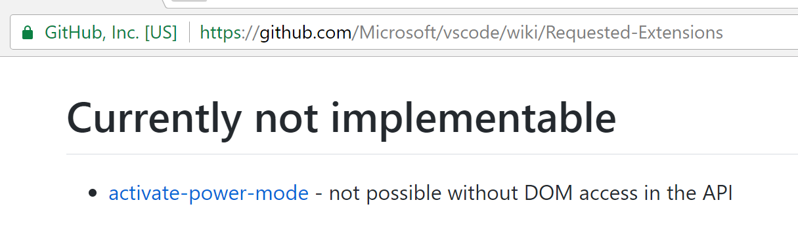
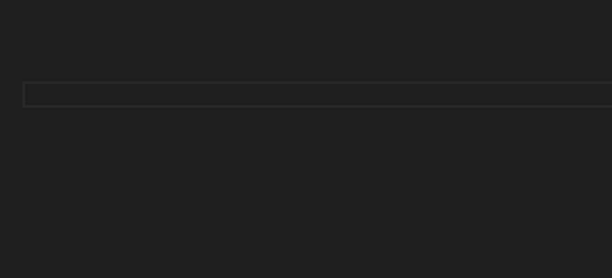
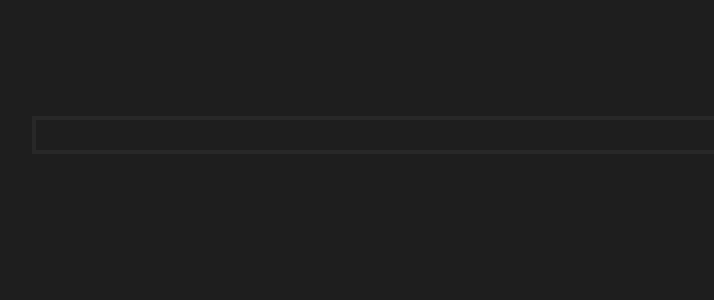
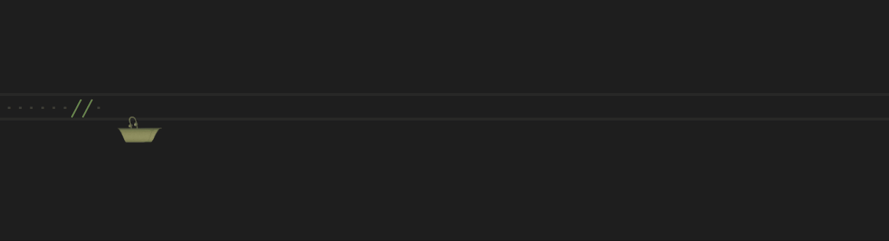
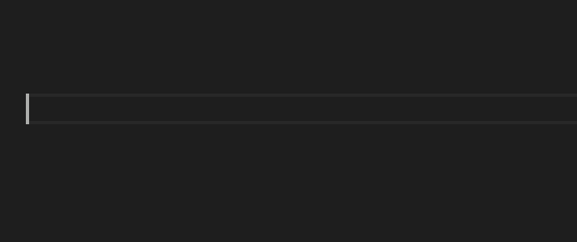

# VSCODE POWER MODE!!!

Power Mode is one of the most requested extensions for VS Code. Unfortunately, they said it couldn't be done...



However, after seeing [this list](https://github.com/codeinthedark/awesome-power-mode) and realizing that VS Code was the only modern editor without it, I knew I had to try. I couldn't let VS Code live in the shadow of its big brother or Atom.

I present you, VSCODE POWER MODE!!! (now with atom-like explosions and an improved combo meter!)



## Features:
* NEW: POWERFUL Combo Meter!
* Atom-like explosions!
* Multiple explosion sets to choose from
* Status bar indicator for combo count and timer
* Explosions and screen shake effect when power mode is reached
* Extremely Customizable

## Get started

* Enable in the settngs UI, or edit the JSON file directly to add `"powermode.enabled": true`
* Enjoy the default experience, or choose from a set of built-in

// TODO: Finish


## Choose Your Explosions:
You can now choose explosions with a single setting: `powermode.presets`. Check out the options below (note: it looks better IRL than in these gifs):

### NEW! Rift (Simple)


### New! Rift (Exploding)


**Note:** If your code becomes hard to read, you may need to set `editor.lineHighlightBackground` in your user or workspace settings. For example, if your theme is `Default Dark+`, try:

```
"editor.lineHighlightBackground": "#1E1E1EAA"
```

### Particles


### Fireworks



### Flames


### Magic


### Clippy



## Configuration:
Hopefully power mode will work great for you out of the box, but if it doesn't I've tried to make power mode as configurable as possible. Tweak the settings for performance or for fun. From doge to clippy, the only limit is your imagination. Some of the options are explained below:

* `powermode.customExplosions`: Choose your own explosions with base64 encoded gifs or full web URLs (i.e. "data:image/gif;base64,1337GIF", "https://coolgif.io"). **NOTE:** Security precautions in the browser engine prevent referencing local files, so for offline-support, please base64 encode the gif.
* `powermode.backgroundMode`: `mask` will use the gif as a mask, letting the shape of the gif through with the color of the text. `image` will use the gif itself as the background.

* `powermode.gifMode`: `restart` will restart a gif each time it is displayed, `continue` will play the gif from the place it stopped. `continue` is particularly useful when you only have 1 visible gif, `restart` is useful when you have multiple, but may reduce performance.
* `powermode.maxExplosions`: Reducing this will reduce the number of explosions rendered at once.
* `powermode.explosionFrequency`: Increasing this will increase the number of keystrokes between explosions. It means that there will be gaps between explosions as you type but may help performance.
* `powermode.customExplosions`: Provide your own gifs to use (And share them [here](https://github.com/hoovercj/vscode-power-mode/issues/1))
* `powermode.customCss`: Changes the CSS applied to the "after" pseudoelement. You can experiment with ways to make it look or perform better.
* `powermode.explosionOrder`: `sequential` will cycle through explosions in order, `random` will pick one randomly, and providing a number will select the explosion at that (zero-based) index in the list of explosions.

## Known Issues

They were right when they said it can't be done. At least not properly. VS Code does not expose the DOM as part of the API. Instead this extension relies on using TextEditorDecorations to set css properties for ranges in the editor. This has a few limitations:
* The cursor doesn't move with the text as it shakes
* The new combo meter moves off the screen when the editor has long lines unless "word wrap" is enabled
* I have to use gifs instead of CSS animations for the particles/explosions

## Help Wanted:
If you can provide some lightweight, attractive gifs that improve how power mode looks and performs, I would be happy to include them! Share them [here](https://github.com/hoovercj/vscode-power-mode/issues/1).

## Acknowledgements:
* Thanks to [@ao-shen](https://github.com/ao-shen) for insight into animating size and colors for the combo-meter
* Thanks to [@RPuffer](https://github.com/RPuffer) for providing the incredible gifs added in version 2.1
* Thanks to [@darkvertex](https://github.com/darkvertex) for providing the awesome gifs added in version 2.0
* Thanks to [@horvay](https://github.com/horvay) for giving me ideas to get around the limitations I had in v0.0.1

## Changelog:
- v2.3.0
  - Added an improved combo meter! Controled via `powermode.enableEditorComboCounter`
  - Bug fixes, with thanks to [@Thertzlor](https://github.com/Thertzlor) and [@hyprhare](https://github.com/hyprhare) for their contributions
- v2.2.0
  - Added `powermode.enableStatusBarComboCounter` and `powermode.enableStatusBarComboTimer` to toggle status bar items
  - Added new presets
  - Bug fixes
- v2.1.0
  - Fixed [#20](https://github.com/hoovercj/vscode-power-mode/issues/20) (Thanks @kirkone)
- v2.0.0
  - Added `powermode.presets` to choose between different built-in explosion sets
  - Added `powermode.backgroundMode` to allow 'atom like' explosions (explosions that match the color of the text being typed)
  - Breaking: Removed `powermode.legacyMode`
  - Breaking: Renamed `powermode.explosionMode` to `powermode.explosionOrder`
  - Breaking: Removed `powermode.settingSuggestions`
- v1.2.1
  - Remove intellisense for CSS configuration due to this [issue](https://github.com/Microsoft/vscode/issues/31932#issuecomment-326341653)
- v1.2.0
  - Suggest configurations in settings.json
- v1.1.0
  - Configure explosion duration
  - Configure explosion "mode": random, sequential, or a specific explosion
  - Reduce default "max explosions" from 5 to 1
- v1.0.0
  - True power mode! Explosions now extend outside the boundaries of a letter
  - Eliminated two of the default explosions that didn't look good when expanded
  - Added new explostion configuration options (explosion number, size, and frequency)
  - Added a Legacy Mode configuration option
  - Shake now resets after 1 second without typing (Thanks @horvay)
- v0.0.1
  - Initial release
  - Explosions work, but limited to size of characters
