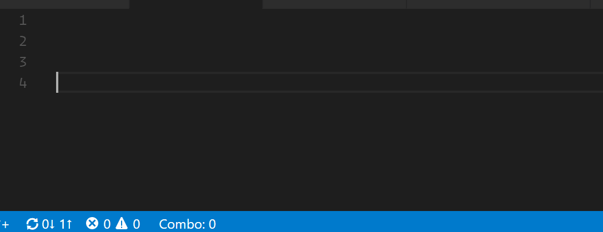

# VSCODE POWER MODE!!!

Power Mode is one of the most requested extensions for VS Code. Unfortunatley, they said it couldn't be done...

However, after seeing [this list](https://github.com/codeinthedark/awesome-power-mode) and realizing that VS Code was the only modern editor without it, I knew I had to try. I couldn't let VS Code live in the shadow of its big brother or Atom.

I present you, VSCODE POWER MODE!!!

## Features:
* A combo counter
* A timer that shows how long until your combo expires
* Awful explosion gifs and screen shake effect when power mode is reached
* Configuration for:
   - Combo timeout
   - The Power Mode combo threshold
   - Choose your own explosions with base64 encoded gifs or full urls
   - Disable explosions
   - Disable shake
   - Set shake intensity

## Known Issues:
They were right when they said it can't be done. At least not properly. VS Code does not expose the DOM as part of the API. Instead this extension relies on using TextEditorDecorations to set css properties for ranges in the editor. This has a few limitations:
* The cursor doesn't move with the text as it shakes
* I have to use gifs instead of CSS animations for the particles/explosions
* I am not an artist, so I am using free gifs I found online
* The explosions are limited to size of the letters themselves. Increasing line-height or letter-spacing might help make the explosions more visible.

## Help Wanted:
If you can provide some lightweight, more attractive gifs that improve how power mode looks and performs, I would be happy to include them!