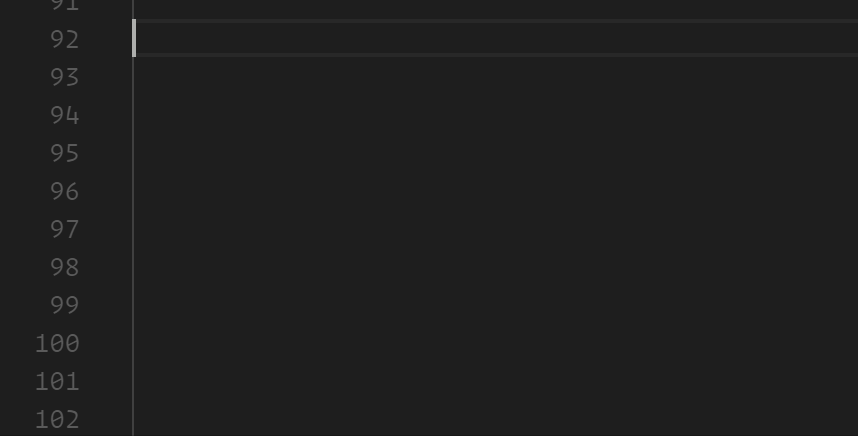

# VSCODE POWER MODE!!!

Power Mode is one of the most requested extensions for VS Code. Unfortunatley, they said it couldn't be done...

However, after seeing [this list](https://github.com/codeinthedark/awesome-power-mode) and realizing that VS Code was the only modern editor without it, I knew I had to try. I couldn't let VS Code live in the shadow of its big brother or Atom.

I present you, VSCODE POWER MODE!!! (NOW WITH ATOM-LIKE EXPLOSIONS!)

To enable, add `"powermode.enabled": true` to your settings.

## Features:
* NEW: Atom-like explosions!
* NEW: Multiple explosion sets to choose from
* A combo counter
* A timer that shows how long until your combo expires
* Awful explosion gifs and screen shake effect when power mode is reached
* Community setting suggestions
* Configuration for:
   - Combo timeout
   - The Power Mode combo threshold
   - Built-in explosion sets
   - Choose your own explosions with base64 encoded gifs or full URIs (i.e. "data:image/gif;base64,1337GIF", "C:/my/cat/gif", "https://coolgif.io")
   - Choose how long the explosions last and how they loop
   - Choose how the gif is displayed (same color as the text or as an image)
   - Choose how to cycle through the explosions (random, sequential, or a specific index)
   - Set the size, number, and frequency of explosions
   - Change the vertical offset of the explosions
   - Disable explosions
   - Disable shake
   - Set shake intensity

## Choose your explosions:
You can now choose your explosions with a single setting: `powermode.presets`. Check out the options below:

# TODO: Add examples here

## Advanced Configuration:
Hopefully power mode will work great for you out of the box, but if it doesn't I've tried to make power mode as configurable as possible. Tweak the settings for performance or for fun. From doge to clippy, the only limit is your imagination.

And now you can now see configurations shared by the community by typing `powermode` (without quotes) in `settings.json`. Share your own ideas with the community [here](https://github.com/hoovercj/vscode-power-mode/issues/7):

**Note:** This feature is experimental and only available with powermode enabled. You can also disable this feature by adding `"powermode.settingSuggestions": false` to your user or workspace settings.

* `powermode.backgroundMode`: `mask` will use the gif as a mask, letting the shape of the gif through with the color of the text. `image` will use the gif itself as the background.
* `powermode.gifMode`: `restart` will restart a gif each time it is displayed, `continue` will play the gif from the place it stopped. `continue` is useful when you only have 1 visible gif, `restart` is useful when you have multiple.
* `powermode.maxExplosions`: Reducing this will reduce the number of explosions rendered at once.
* `powermode.explosionFrequency`: Increasing this will increase the number of keystrokes between explosions. It means that there will be gaps between explosions as you type but may help performance.
* `powermode.customExplosions`: Provide your own lighter weight gifs to use (And share them [here](https://github.com/hoovercj/vscode-power-mode/issues/1))
* `powermode.customCss`: Changes the CSS applied to the "after" pseudoelement. You can experiment with ways to make it look or perform better.

## Known Issues

They were right when they said it can't be done. At least not properly. VS Code does not expose the DOM as part of the API. Instead this extension relies on using TextEditorDecorations to set css properties for ranges in the editor. This has a few limitations:
* The cursor doesn't move with the text as it shakes
* When deleting characters, the explosion will briefly move to the beginning of the line. This is because I am using an "after" pseudoclass to apply the decorations, and when you delete the letter that it is anchored to it repositions to the next anchor which is the entire line.
* I have to use gifs instead of CSS animations for the particles/explosions

## Help Wanted:
If you can provide some lightweight, more attractive gifs that improve how power mode looks and performs, I would be happy to include them!

## Acknowledgements:
Thanks to [@darkvertex](https://github.com/darkvertex) for providing awesome gifs added in version 2.0
Thanks to [@horvay](https://github.com/horvay) for giving me ideas to get around the limitations I had in v0.0.1

## Changelog:
- v2.0
 - Removed `powermode.legacyMode`
 - Added `powermode.presets` to choose between different built-in explosion sets
 - Added `powermode.backgroundMode` to allow 'atom like' explosions (explosions that match the color of the text being typed)
- v1.2.1
  - Remove intellisense for CSS configuration due to this [issue](https://github.com/Microsoft/vscode/issues/31932#issuecomment-326341653)
- v1.2.0
  - Suggest configurations in settings.json
- v1.1.0
  - Configure explosion duration
  - Configure explosion "mode": random, sequential, or a specific explosion
  - Reduce default "max explosions" from 5 to 1
- v1.0.0
  - True power mode! Explosions now extend outside the boundaries of a letter
  - Eliminated two of the default explosions that didn't look good when expanded
  - Added new explostion configuration options (explosion number, size, and frequency)
  - Added a Legacy Mode configuration option
  - Shake now resets after 1 second without typing (Thanks @horvay)
- v0.0.1
  - Initial release
  - Explosions work, but limited to size of characters